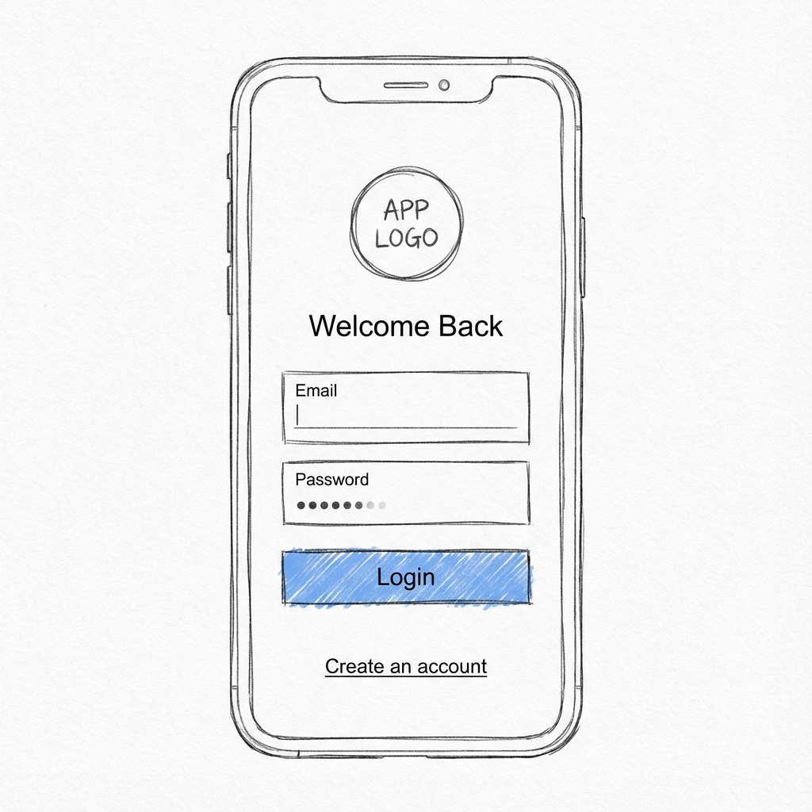
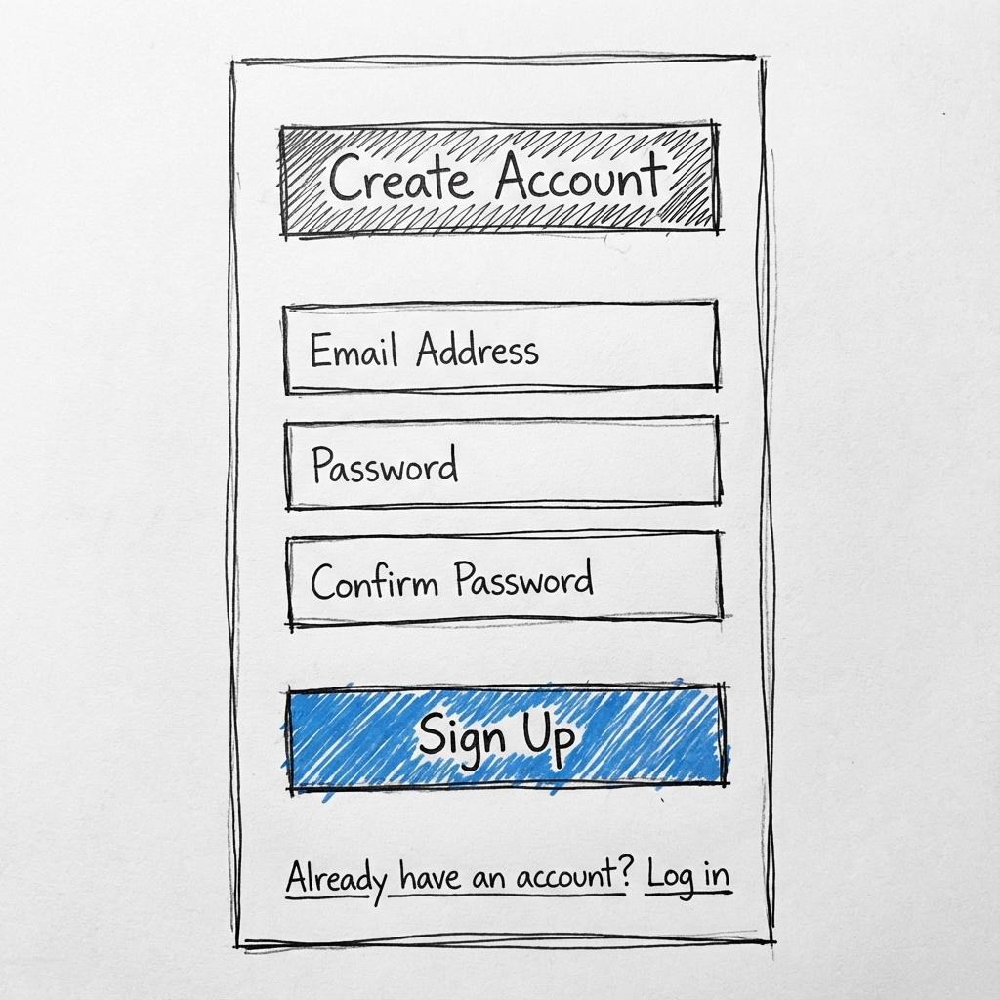
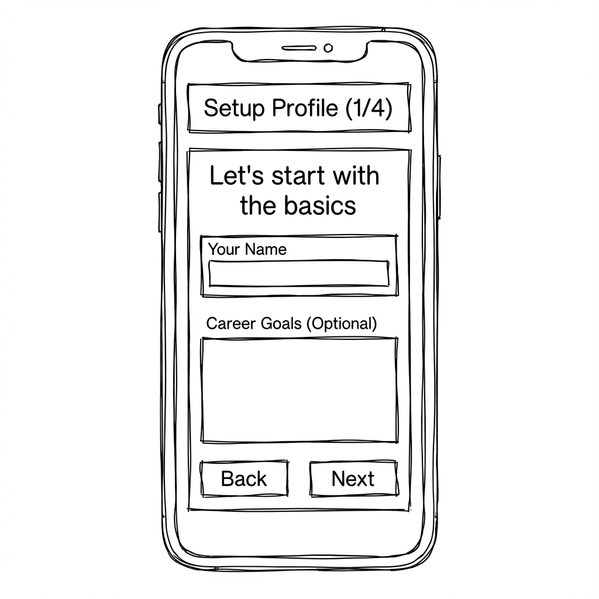
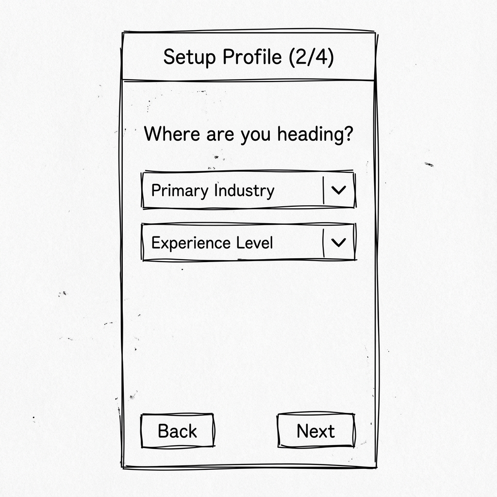
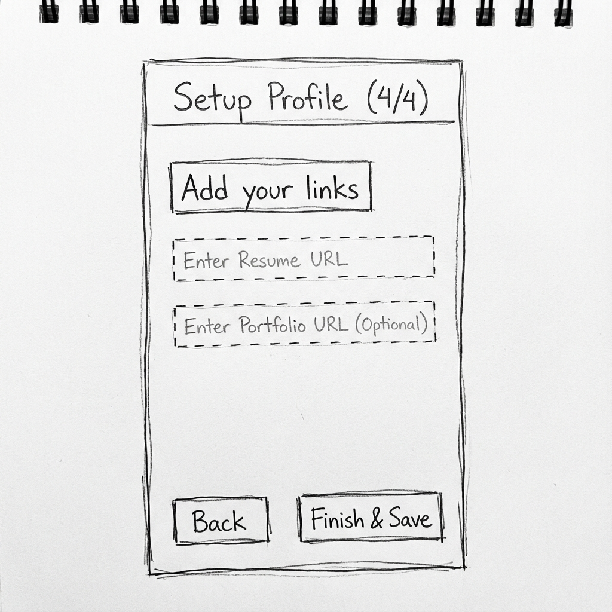
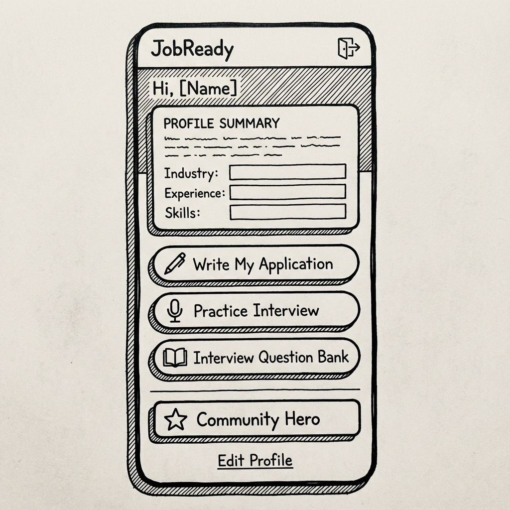

# JobReady App - Complete Wireframe Documentation

> **Low-Fidelity Wireframes for All Screens**
> 
> This document provides comprehensive wireframe specifications for every screen in the JobReady Flutter application.

---

## Table of Contents

1. [Authentication Flow](#authentication-flow)
2. [Main App Screens](#main-app-screens)
3. [Feature Screens](#feature-screens)
4. [Question Bank](#question-bank)
5. [Community Feature](#community-feature)
6. [Navigation Flow](#navigation-flow)

---

## Authentication Flow

### 1. Login Screen

**Purpose**: Allow existing users to log into their account

**Layout**:
```
┌─────────────────────────────┐
│                             │
│      [JobReady Logo]        │
│                             │
│      Welcome Back           │
│                             │
│   ┌───────────────────┐     │
│   │ Email             │     │
│   └───────────────────┘     │
│                             │
│   ┌───────────────────┐     │
│   │ Password          │     │
│   └───────────────────┘     │
│                             │
│   ┌───────────────────┐     │
│   │      Login        │     │
│   └───────────────────┘     │
│                             │
│   Create an account         │
│                             │
└─────────────────────────────┘
```

**Components**:
- Logo/branding area (top center)
- Heading: "Welcome Back" (28px, bold, centered)
- Email input field (outlined, with label)
- Password input field (outlined, obscured, with label)
- Login button (full-width, primary color, 16px vertical padding)
- "Create an account" text link (centered)
- Loading indicator (shows when processing)

**Interactions**:
- Form validation on submit
- Navigate to Signup screen via text link
- Navigate to Personalized Home on successful login
- Navigate to Onboarding if profile incomplete

---

### 2. Signup Screen

**Purpose**: Allow new users to create an account

**Layout**:
```
┌─────────────────────────────┐
│                             │
│    Create Account           │
│                             │
│   ┌───────────────────┐     │
│   │ Email             │     │
│   └───────────────────┘     │
│                             │
│   ┌───────────────────┐     │
│   │ Password          │     │
│   └───────────────────┘     │
│                             │
│   ┌───────────────────┐     │
│   │ Confirm Password  │     │
│   └───────────────────┘     │
│                             │
│   ┌───────────────────┐     │
│   │     Sign Up       │     │
│   └───────────────────┘     │
│                             │
│   Already have an account?  │
│          Log in             │
│                             │
└─────────────────────────────┘
```

**Components**:
- Heading: "Create Account" (28px, bold, centered)
- Email input field
- Password input field
- Confirm password input field
- Sign Up button (full-width, primary color)
- "Already have an account? Log in" text link
- Loading indicator

**Interactions**:
- Password matching validation
- Navigate to Login screen via text link
- Navigate to Onboarding on successful signup

---

### 3. Onboarding Screen - Step 1/4

**Purpose**: Collect basic user information

**Layout**:
```
┌─────────────────────────────┐
│ Setup Profile (1/4)    [×]  │
├─────────────────────────────┤
│                             │
│ Let's start with the basics │
│                             │
│   ┌───────────────────┐     │
│   │ Your Name         │     │
│   └───────────────────┘     │
│                             │
│   ┌───────────────────┐     │
│   │ Career Goals      │     │
│   │ (Optional)        │     │
│   │                   │     │
│   └───────────────────┘     │
│                             │
│                             │
│                             │
│  [Back]          [Next]     │
└─────────────────────────────┘
```

**Components**:
- App bar: "Setup Profile (1/4)"
- Title: "Let's start with the basics" (20px, bold)
- Name text field (single line, required)
- Career Goals text area (multi-line, optional, 3 rows)
- Back button (disabled on step 1)
- Next button (validates before proceeding)

**Validation**:
- Name field must not be empty

---

### 4. Onboarding Screen - Step 2/4

**Purpose**: Collect career direction information

**Layout**:
```
┌─────────────────────────────┐
│ Setup Profile (2/4)    [×]  │
├─────────────────────────────┤
│                             │
│ Where are you heading?      │
│                             │
│   ┌───────────────────┐     │
│   │ Primary Industry ▼│     │
│   └───────────────────┘     │
│                             │
│   ┌───────────────────┐     │
│   │ Experience Level ▼│     │
│   └───────────────────┘     │
│                             │
│                             │
│                             │
│                             │
│  [Back]          [Next]     │
└─────────────────────────────┘
```

**Components**:
- App bar: "Setup Profile (2/4)"
- Title: "Where are you heading?" (20px, bold)
- Primary Industry dropdown (IT & Software, Sales & Marketing, Core Engineering, BPO & Support)
- Experience Level dropdown (Fresher 0 years, 1-3 years, 3-5 years)
- Back button
- Next button

**Validation**:
- Both dropdowns must have selections

---

### 5. Onboarding Screen - Step 3/4

**Purpose**: Collect skill information

**Layout**:
```
┌─────────────────────────────┐
│ Setup Profile (3/4)    [×]  │
├─────────────────────────────┤
│                             │
│ What are your top skills?   │
│ Select up to 3              │
│                             │
│  [Java] [Python] [Web Dev] │
│                             │
│  [DSA] [SQL] [Other]       │
│                             │
│                             │
│                             │
│                             │
│                             │
│  [Back]          [Next]     │
└─────────────────────────────┘
```

**Components**:
- App bar: "Setup Profile (3/4)"
- Title: "What are your top skills?" (20px, bold)
- Subtitle: "Select up to 3" (14px, grey)
- Skill chips (filter chips, selectable, max 3)
- Chips change based on selected industry
- Back button
- Next button

**Validation**:
- At least 1 skill must be selected
- Maximum 3 skills allowed

---

### 6. Onboarding Screen - Step 4/4

**Purpose**: Collect portfolio links

**Layout**:
```
┌─────────────────────────────┐
│ Setup Profile (4/4)    [×]  │
├─────────────────────────────┤
│                             │
│ Add your links              │
│                             │
│   ┌───────────────────┐     │
│   │ Resume URL        │     │
│   │ https://...       │     │
│   └───────────────────┘     │
│                             │
│   ┌───────────────────┐     │
│   │ Portfolio URL     │     │
│   │ (Optional)        │     │
│   │ https://...       │     │
│   └───────────────────┘     │
│                             │
│                             │
│  [Back]    [Finish & Save]  │
└─────────────────────────────┘
```

**Components**:
- App bar: "Setup Profile (4/4)"
- Title: "Add your links" (20px, bold)
- Resume URL text field (with placeholder)
- Portfolio URL text field (optional, with placeholder)
- Back button
- Finish & Save button

**Interactions**:
- Saves profile data
- Navigates to Personalized Home Screen

---

## Main App Screens

### 7. Personalized Home Screen

**Purpose**: Main hub for authenticated users with personalized content

**Layout**:
```
┌─────────────────────────────┐
│ JobReady - Hi, [Name]  [⚙]  │
├─────────────────────────────┤
│ ┌─────────────────────────┐ │
│ │ Your Profile            │ │
│ │─────────────────────────│ │
│ │ Industry: IT & Software │ │
│ │ Experience: 1-3 years   │ │
│ │ Skills: Java, Python... │ │
│ │ Goal: Get first job...  │ │
│ └─────────────────────────┘ │
│                             │
│ ┌───────────────────────┐   │
│ │ 📝 Write My Application│   │
│ └───────────────────────┘   │
│                             │
│ ┌───────────────────────┐   │
│ │ 🎤 Practice Interview  │   │
│ └───────────────────────┘   │
│                             │
│ ┌───────────────────────┐   │
│ │ 📚 Question Bank       │   │
│ └───────────────────────┘   │
│                             │
│ ┌───────────────────────┐   │
│ │ 💬 Community           │   │
│ └───────────────────────┘   │
│                             │
│      Edit Profile           │
└─────────────────────────────┘
```

**Components**:
- App bar: "JobReady - Hi, [Name]" with logout icon
- Profile summary card (elevated, rounded)
  - Industry, experience, skills, goals
- Action buttons (full-width, elevated):
  - Write My Application (document icon, primary color)
  - Practice Interview (mic icon, teal)
  - Interview Question Bank (book icon, indigo)
  - Community (chat icon, purple)
- Edit Profile text link
- Logout button in app bar

**Interactions**:
- Navigate to Writer screen
- Navigate to Speaker screen
- Navigate to Question Bank
- Navigate to Community
- Navigate to Onboarding (edit mode)
- Logout and return to Login

---

### 8. Dashboard Screen (Industry Selection)

**Purpose**: Industry selection for non-personalized flow

**Layout**:
```
┌─────────────────────────────┐
│                             │
│       JobReady              │
│  Your Pocket Placement Cell │
│                             │
│  Choose your industry       │
│                             │
│ ┌──────────┐ ┌──────────┐   │
│ │ 💻       │ │ 📈       │   │
│ │ IT &     │ │ Sales &  │   │
│ │ Software │ │ Marketing│   │
│ └──────────┘ └──────────┘   │
│                             │
│ ┌──────────┐ ┌──────────┐   │
│ │ ⚙️       │ │ 🎧       │   │
│ │ Core     │ │ BPO &    │   │
│ │ Engineer │ │ Support  │   │
│ └──────────┘ └──────────┘   │
│                             │
│ ┌───────────────────────┐   │
│ │ 🔓 Interview Leaks    │   │
│ └───────────────────────┘   │
│                             │
│ ┌───────────────────────┐   │
│ │ 📚 Question Bank      │   │
│ └───────────────────────┘   │
│                             │
│ [    Ad Banner Area    ]    │
└─────────────────────────────┘
```

**Components**:
- Header section:
  - "JobReady" title (28px, bold, primary color)
  - Tagline: "Your Pocket Placement Cell" (14px, grey)
  - Section title: "Choose your industry" (20px, bold)
- Industry grid (2x2):
  - IT & Software (blue)
  - Sales & Marketing (green)
  - Core Engineering (orange)
  - BPO & Support (purple)
  - Each card has icon and title
- Unlock Interview Leaks button (outlined, amber)
- Interview Question Bank card (indigo background)
- Ad banner placeholder (60px height, grey background)

**Interactions**:
- Tap industry card → Navigate to Mode Selection
- Tap Interview Leaks → Navigate to Leaks screen
- Tap Question Bank → Navigate to Question Bank selector

---

### 9. Mode Selection Screen

**Purpose**: Choose between Writer and Speaker modes

**Layout**:
```
┌─────────────────────────────┐
│ ← Select Mode               │
├─────────────────────────────┤
│                             │
│                             │
│   Selected Industry:        │
│   IT & Software             │
│                             │
│                             │
│ ┌───────────────────────┐   │
│ │ 📝                    │   │
│ │ Write My Application  │   │
│ └───────────────────────┘   │
│                             │
│ ┌───────────────────────┐   │
│ │ 🎤                    │   │
│ │ Practice Interview    │   │
│ └───────────────────────┘   │
│                             │
│                             │
│                             │
│                             │
│ [    Ad Banner Area    ]    │
└─────────────────────────────┘
```

**Components**:
- App bar: "Select Mode" with back button
- Selected industry display (16px grey, 24px bold)
- Two mode buttons (full-width, 64px height):
  - Write My Application (document icon)
  - Practice Interview (mic icon)
- Ad banner placeholder

**Interactions**:
- Navigate to Writer screen with industry context
- Navigate to Speaker screen with industry context

---

## Feature Screens

### 10. Writer Screen (Application Writer)

**Purpose**: Generate customized job applications

**Layout**:
```
┌─────────────────────────────┐
│ ← Write My Application      │
├─────────────────────────────┤
│ ┌───────────────────────┐   │
│ │ Document Type       ▼ │   │
│ └───────────────────────┘   │
│                             │
│ ┌───────────────────────┐   │
│ │ Experience Level    ▼ │   │
│ └───────────────────────┘   │
│                             │
│ ┌───────────────────────┐   │
│ │ Skill               ▼ │   │
│ └───────────────────────┘   │
│                             │
│ Tone: ○ Formal ○ Warm       │
│                             │
│ ┌───────────────────────┐   │
│ │ Your Name             │   │
│ └───────────────────────┘   │
│                             │
│ ┌───────────────────────┐   │
│ │ Company Name          │   │
│ └───────────────────────┘   │
│                             │
│ ┌───────────────────────┐   │
│ │ Role                  │   │
│ └───────────────────────┘   │
│                             │
│ ┌───────────────────────┐   │
│ │    Generate           │   │
│ └───────────────────────┘   │
│                             │
│ ┌─────────────────────────┐ │
│ │ Generated Content       │ │
│ │                         │ │
│ │ Dear Hiring Manager...  │ │
│ │                         │ │
│ └─────────────────────────┘ │
│                             │
│ [Copy] [Share] [Download]   │
└─────────────────────────────┘
```

**Components**:
- App bar with back button
- Form section (scrollable):
  - Document Type dropdown (Cover Letter, LinkedIn Note, Cold Email)
  - Experience Level dropdown
  - Skill dropdown (industry-specific)
  - Tone selector (radio buttons: Formal, Warm, Salesy)
  - Name text field
  - Company text field
  - Role text field
  - Resume URL field
  - Portfolio URL field
  - Achievement builder section
  - Strengths selector
  - ATS optimization toggle
- Generate button (primary, full-width)
- Preview section:
  - Generated text display (card, scrollable)
  - Copy button
  - Share button
  - Download PDF button
- Rewrite options (Make Shorter, Longer, Simpler, More Formal)
- Tips section (contextual based on selections)

**Interactions**:
- Form validation before generation
- Generate content based on template + user inputs
- Copy to clipboard
- Share via system share sheet
- Download as PDF

---

### 11. Speaker Screen (Practice Interview)

**Purpose**: Voice-based interview practice with AI feedback

**Layout**:
```
┌─────────────────────────────┐
│ ← Practice Interview        │
├─────────────────────────────┤
│                             │
│  Question 1 of 10           │
│  ━━━━━━━━━━━━━━━━━━━━━━━━  │
│                             │
│ ┌─────────────────────────┐ │
│ │                         │ │
│ │ Tell me about yourself  │ │
│ │ and your background?    │ │
│ │                         │ │
│ └─────────────────────────┘ │
│                             │
│                             │
│       ┌───────┐             │
│       │  🎤   │             │
│       │       │             │
│       └───────┘             │
│                             │
│    Tap to Start Recording   │
│                             │
│                             │
│ ┌─────────────────────────┐ │
│ │ Your Answer:            │ │
│ │                         │ │
│ │ [Transcribed text...]   │ │
│ │                         │ │
│ └─────────────────────────┘ │
│                             │
│ ┌─────────────────────────┐ │
│ │ AI Feedback:            │ │
│ │ • Good structure        │ │
│ │ • Add more specifics    │ │
│ └─────────────────────────┘ │
│                             │
│  [Skip]           [Next]    │
└─────────────────────────────┘
```

**Components**:
- App bar with back button
- Progress indicator (question X of Y)
- Question card (elevated, large text)
- Recording button (large, circular, mic icon)
- Recording status indicator
- Timer display
- Transcription display area
- AI feedback section:
  - Strengths
  - Areas to improve
  - Suggested improvements
- Navigation buttons:
  - Skip question
  - Next question
  - Finish session
- Model answer toggle
- Session summary at end

**Interactions**:
- Start/stop voice recording
- Real-time speech-to-text
- AI analysis of response
- Navigate between questions
- View model answers
- Complete session and view summary

---

### 12. Interview Leaks Screen

**Purpose**: Access to curated interview questions from real companies

**Layout**:
```
┌─────────────────────────────┐
│ ← Interview Leaks           │
├─────────────────────────────┤
│                             │
│  🔓 Unlock Real Interview   │
│     Questions               │
│                             │
│ ┌─────────────────────────┐ │
│ │ 🏢 Google               │ │
│ │ Software Engineer       │ │
│ │ 15 Questions            │ │
│ └─────────────────────────┘ │
│                             │
│ ┌─────────────────────────┐ │
│ │ 🏢 Amazon               │ │
│ │ SDE Intern              │ │
│ │ 12 Questions            │ │
│ └─────────────────────────┘ │
│                             │
│ ┌─────────────────────────┐ │
│ │ 🏢 Microsoft            │ │
│ │ Full Stack Developer    │ │
│ │ 20 Questions            │ │
│ └─────────────────────────┘ │
│                             │
│ ┌─────────────────────────┐ │
│ │ 🏢 Flipkart             │ │
│ │ Backend Developer       │ │
│ │ 10 Questions            │ │
│ └─────────────────────────┘ │
│                             │
│ [Filter by Company] [Role]  │
└─────────────────────────────┘
```

**Components**:
- App bar with back button
- Header section with icon and title
- Company cards (scrollable list):
  - Company name
  - Role
  - Number of questions
  - Difficulty indicator
- Filter options:
  - By company
  - By role
  - By difficulty
- Search bar

**Interactions**:
- Tap card to view questions
- Filter and search
- Bookmark questions

---

## Question Bank

### 13. Question Bank Industry Selector

**Purpose**: Select industry to view relevant questions

**Layout**:
```
┌─────────────────────────────┐
│ ← Interview Question Bank   │
├─────────────────────────────┤
│                             │
│  Select Your Industry       │
│                             │
│ ┌─────────────────────────┐ │
│ │ 💻 IT & Software        │ │
│ │ 150+ Questions          │ │
│ └─────────────────────────┘ │
│                             │
│ ┌─────────────────────────┐ │
│ │ 📈 Sales & Marketing    │ │
│ │ 120+ Questions          │ │
│ └─────────────────────────┘ │
│                             │
│ ┌─────────────────────────┐ │
│ │ ⚙️ Core Engineering     │ │
│ │ 100+ Questions          │ │
│ └─────────────────────────┘ │
│                             │
│ ┌─────────────────────────┐ │
│ │ 🎧 BPO & Support        │ │
│ │ 90+ Questions           │ │
│ └─────────────────────────┘ │
│                             │
│                             │
└─────────────────────────────┘
```

**Components**:
- App bar with back button
- Title: "Select Your Industry"
- Industry cards (full-width):
  - Icon
  - Industry name
  - Question count
  - Arrow indicator
- Each card is tappable

**Interactions**:
- Tap industry → Navigate to Question Bank Viewer

---

### 14. Question Bank Viewer

**Purpose**: Browse and view interview questions with model answers

**Layout**:
```
┌─────────────────────────────┐
│ ← IT & Software Questions   │
├─────────────────────────────┤
│ [All] [Technical] [HR]      │
│ [Behavioral]                │
│                             │
│ ┌─────────────────────────┐ │
│ │ Q: Tell me about        │ │
│ │    yourself?            │ │
│ │                         │ │
│ │ Category: HR            │ │
│ │ Difficulty: ⭐⭐        │ │
│ │                         │ │
│ │ [View Model Answer]     │ │
│ └─────────────────────────┘ │
│                             │
│ ┌─────────────────────────┐ │
│ │ Q: What is OOP?         │ │
│ │                         │ │
│ │ Category: Technical     │ │
│ │ Difficulty: ⭐⭐⭐      │ │
│ │                         │ │
│ │ [View Model Answer]     │ │
│ └─────────────────────────┘ │
│                             │
│ ┌─────────────────────────┐ │
│ │ Q: Describe a time...   │ │
│ │                         │ │
│ │ Category: Behavioral    │ │
│ │ Difficulty: ⭐⭐⭐      │ │
│ │                         │ │
│ │ [View Model Answer]     │ │
│ └─────────────────────────┘ │
│                             │
│ [Discuss in Community]      │
└─────────────────────────────┘
```

**Components**:
- App bar: "[Industry] Questions" with back button
- Category filter chips (All, Technical, HR, Behavioral)
- Question cards (scrollable):
  - Question text
  - Category badge
  - Difficulty stars
  - "View Model Answer" button (expandable)
  - Bookmark icon
- Model answer section (expandable):
  - Structured answer
  - Key points
  - Tips
- "Discuss in Community" button at bottom
- Search functionality

**Interactions**:
- Filter by category
- Expand/collapse model answers
- Bookmark questions
- Navigate to Community to discuss
- Search questions

---

## Community Feature

### 15. Community Home Screen

**Purpose**: Browse community discussions and threads

**Layout**:
```
┌─────────────────────────────┐
│ ← Community            [+]  │
├─────────────────────────────┤
│ [Trending] [Recent] [My]    │
│                             │
│ ┌─────────────────────────┐ │
│ │ 👤 John Doe             │ │
│ │ How to answer "Why      │ │
│ │ should we hire you?"    │ │
│ │                         │ │
│ │ 💬 15  👍 23  2h ago    │ │
│ └─────────────────────────┘ │
│                             │
│ ┌─────────────────────────┐ │
│ │ 👤 Jane Smith           │ │
│ │ Tips for virtual        │ │
│ │ interviews              │ │
│ │                         │ │
│ │ 💬 8   👍 12  5h ago    │ │
│ └─────────────────────────┘ │
│                             │
│ ┌─────────────────────────┐ │
│ │ 👤 Mike Johnson         │ │
│ │ Got offer from TCS!     │ │
│ │ AMA                     │ │
│ │                         │ │
│ │ 💬 32  👍 45  1d ago    │ │
│ └─────────────────────────┘ │
│                             │
│ ┌─────────────────────────┐ │
│ │ 👤 Sarah Lee            │ │
│ │ Salary negotiation      │ │
│ │ advice needed           │ │
│ │                         │ │
│ │ 💬 20  👍 18  2d ago    │ │
│ └─────────────────────────┘ │
└─────────────────────────────┘
```

**Components**:
- App bar: "Community" with back button and "+" (new thread) button
- Tab bar: Trending, Recent, My Posts
- Thread cards (scrollable):
  - Author avatar and name
  - Thread title
  - Preview text (truncated)
  - Engagement metrics (comments, upvotes)
  - Timestamp
  - Category tag (optional)
- Floating action button for new thread

**Interactions**:
- Switch between tabs
- Tap thread → Navigate to Thread Detail
- Tap "+" → Navigate to New Thread
- Pull to refresh
- Infinite scroll

---

### 16. Thread Detail Screen

**Purpose**: View full thread with comments and discussions

**Layout**:
```
┌─────────────────────────────┐
│ ← Thread                    │
├─────────────────────────────┤
│ 👤 John Doe        2h ago   │
│                             │
│ How to answer "Why should   │
│ we hire you?"               │
│                             │
│ I have an interview coming  │
│ up and I'm struggling with  │
│ this question. What's the   │
│ best approach?              │
│                             │
│ 👍 23  💬 15                │
│                             │
│ ─────────────────────────   │
│                             │
│ 💬 15 Comments              │
│                             │
│ ┌─────────────────────────┐ │
│ │ 👤 Jane  1h ago         │ │
│ │ Focus on your unique    │ │
│ │ value proposition...    │ │
│ │ 👍 8                    │ │
│ └─────────────────────────┘ │
│                             │
│ ┌─────────────────────────┐ │
│ │ 👤 Mike  30m ago        │ │
│ │ I used the STAR method  │ │
│ │ and it worked great...  │ │
│ │ 👍 5                    │ │
│ └─────────────────────────┘ │
│                             │
│ ┌───────────────────────┐   │
│ │ Add a comment...      │   │
│ └───────────────────────┘   │
└─────────────────────────────┘
```

**Components**:
- App bar with back button
- Original post section:
  - Author info (avatar, name, timestamp)
  - Thread title
  - Full content
  - Upvote button and count
  - Comment count
- Comments section:
  - Comment count header
  - Comment cards:
    - Author info
    - Comment text
    - Upvote button
    - Reply button
    - Timestamp
- Comment input field (bottom)
- Send button

**Interactions**:
- Upvote post/comments
- Add new comment
- Reply to comments (nested)
- Share thread
- Report/flag content

---

### 17. New Thread Screen

**Purpose**: Create a new community discussion thread

**Layout**:
```
┌─────────────────────────────┐
│ ✕  New Thread        [Post] │
├─────────────────────────────┤
│                             │
│ ┌───────────────────────┐   │
│ │ Thread Title          │   │
│ └───────────────────────┘   │
│                             │
│ ┌───────────────────────┐   │
│ │ Category            ▼ │   │
│ └───────────────────────┘   │
│                             │
│ ┌─────────────────────────┐ │
│ │ What's on your mind?    │ │
│ │                         │ │
│ │                         │ │
│ │                         │ │
│ │                         │ │
│ │                         │ │
│ │                         │ │
│ └─────────────────────────┘ │
│                             │
│ [📎 Attach] [#Tags]         │
│                             │
│                             │
│                             │
│                             │
└─────────────────────────────┘
```

**Components**:
- App bar: "New Thread" with close (×) and "Post" button
- Title text field (single line, required)
- Category dropdown (Interview Tips, Career Advice, Success Stories, Questions, etc.)
- Content text area (multi-line, required)
- Attachment button (optional)
- Tags input (optional)
- Character counter
- Post button (disabled until valid)

**Validation**:
- Title must not be empty
- Content must not be empty
- Category must be selected

**Interactions**:
- Create thread and navigate back to Community
- Cancel and discard draft
- Add attachments
- Add tags

---

## Navigation Flow

### User Journey Map

```
┌─────────────┐
│   Signup    │
└──────┬──────┘
       │
       ▼
┌─────────────┐
│ Onboarding  │
│  (4 steps)  │
└──────┬──────┘
       │
       ▼
┌─────────────────────────┐
│ Personalized Home       │
│                         │
│ ┌─────────────────────┐ │
│ │ Writer              │─┼─→ Writer Screen
│ └─────────────────────┘ │
│ ┌─────────────────────┐ │
│ │ Speaker             │─┼─→ Speaker Screen
│ └─────────────────────┘ │
│ ┌─────────────────────┐ │
│ │ Question Bank       │─┼─→ Industry Selector → Viewer
│ └─────────────────────┘ │
│ ┌─────────────────────┐ │
│ │ Community           │─┼─→ Community Home → Thread Detail
│ └─────────────────────┘ │
└─────────────────────────┘
```

### Alternative Flow (Non-authenticated)

```
┌─────────────┐
│  Dashboard  │
└──────┬──────┘
       │
       ▼
┌─────────────┐
│   Select    │
│  Industry   │
└──────┬──────┘
       │
       ▼
┌─────────────┐
│   Select    │
│    Mode     │
└──────┬──────┘
       │
       ├─→ Writer Screen
       │
       └─→ Speaker Screen
```

---

## Design System Reference

### Spacing
- s4: 4px
- s8: 8px
- s12: 12px
- s16: 16px (standard padding)
- s24: 24px (section spacing)

### Typography
- Title: 28px, bold (Poppins)
- Heading: 20px, bold
- Subtitle: 16px, semi-bold
- Body: 14px, regular
- Caption: 12px, grey

### Colors
- Primary: #1565C0 (blue)
- Surface: #FFFFFF (white)
- Background: #F5F5F5 (light grey)
- Teal: For Practice Interview
- Indigo: For Question Bank
- Purple: For Community
- Amber: For Interview Leaks

### Components
- Cards: Elevated, 12px border radius
- Buttons: 12px border radius, 16px vertical padding
- Input fields: Outlined, with labels
- Chips: Rounded, selectable
- Icons: 24px standard, 32px for cards

---

## Screen Summary

| # | Screen Name | Purpose | Key Features |
|---|-------------|---------|--------------|
| 1 | Login | User authentication | Email/password, validation |
| 2 | Signup | Account creation | Email/password/confirm |
| 3 | Onboarding 1 | Basic info | Name, goals |
| 4 | Onboarding 2 | Career direction | Industry, experience |
| 5 | Onboarding 3 | Skills | Skill selection (max 3) |
| 6 | Onboarding 4 | Links | Resume, portfolio URLs |
| 7 | Personalized Home | Main hub | Profile, quick actions |
| 8 | Dashboard | Industry selection | 4 industries, extras |
| 9 | Mode Selection | Choose mode | Writer or Speaker |
| 10 | Writer | Generate applications | Form, templates, preview |
| 11 | Speaker | Interview practice | Voice recording, AI feedback |
| 12 | Interview Leaks | Real questions | Company-wise questions |
| 13 | QB Industry Selector | Select industry | 4 industries with counts |
| 14 | QB Viewer | Browse questions | Filters, model answers |
| 15 | Community Home | Browse threads | Tabs, thread list |
| 16 | Thread Detail | View discussion | Post, comments, replies |
| 17 | New Thread | Create thread | Title, category, content |

---

## Generated Wireframe Images

The following wireframe images have been generated for the first 7 screens:

### 1. Login Screen


### 2. Signup Screen


### 3. Onboarding Step 1


### 4. Onboarding Step 2


### 5. Onboarding Step 3


### 6. Onboarding Step 4


### 7. Personalized Home


> **Note**: Additional wireframe images for remaining screens can be generated once the image generation quota resets.

---

## Next Steps

1. **Review wireframes** - Validate layout and component placement
2. **Refine interactions** - Add micro-interactions and animations
3. **Create high-fidelity mockups** - Add colors, images, branding
4. **Build component library** - Reusable Flutter widgets
5. **Implement responsive design** - Tablet and landscape support
6. **User testing** - Validate flows with target users

---

*Document created: November 25, 2025*
*Version: 1.0*
*Status: Low-Fidelity Wireframes Complete*
